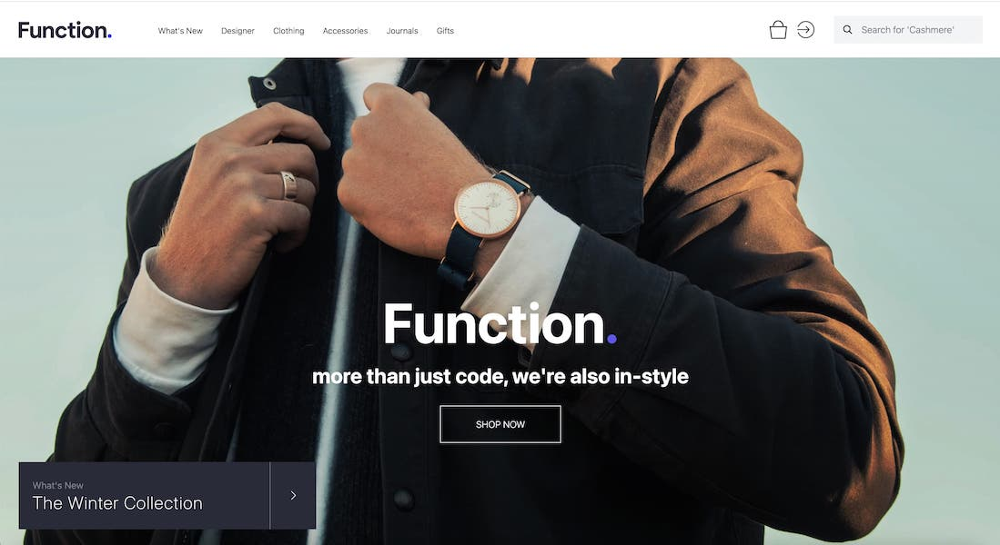
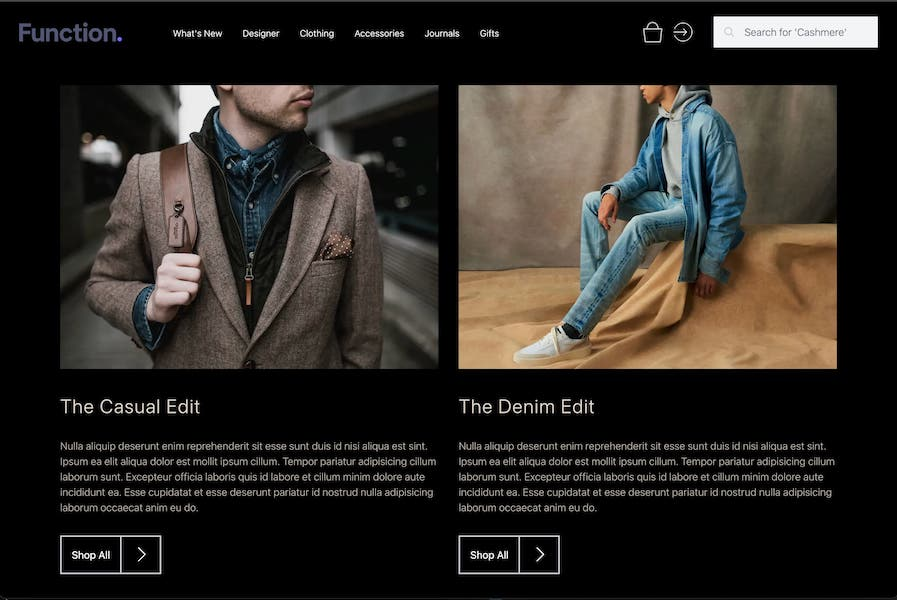
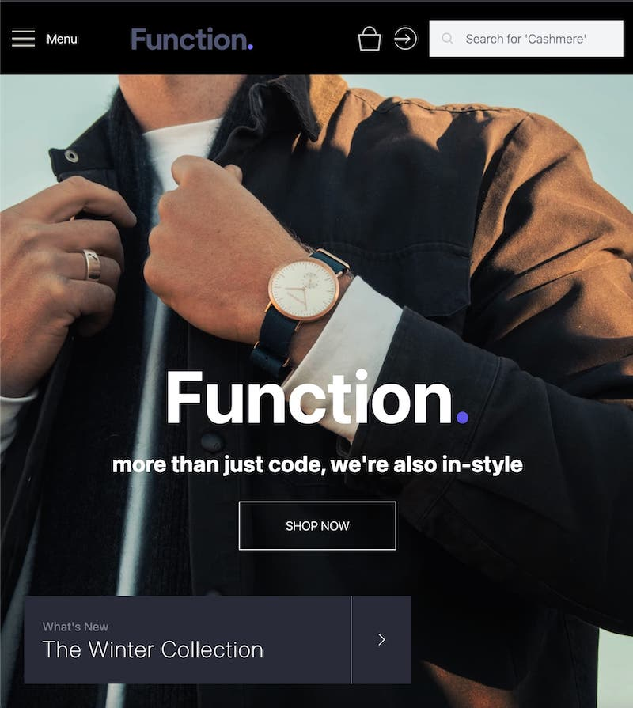
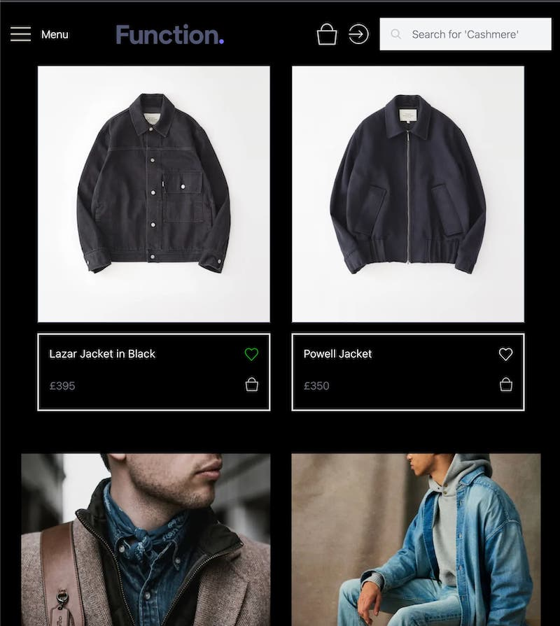
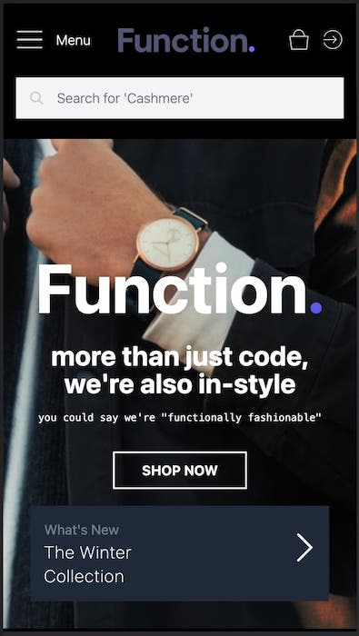
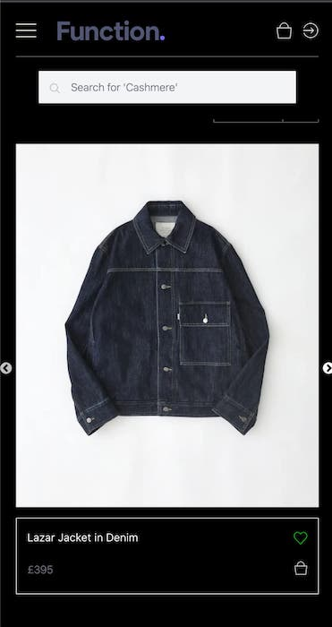
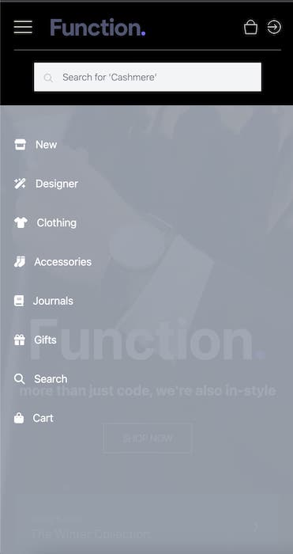
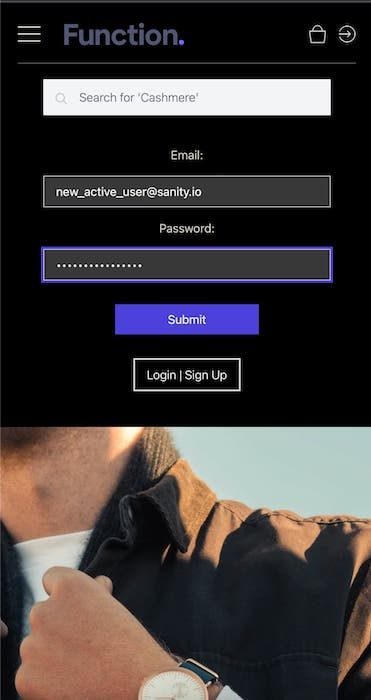

<!-- Readme top-->

<a name="readme-top"></a>

<!-- Project shields -->
<span style="display:block" align="center" class="shields">

[![Stargazers][stars-shield]][stars-url]
[![Issues][issues-shield]][issues-url]
[![License][license-shield]][license-url]
[![LinkedIn][linkedin-shield]][linkedin-url]

</span>

<!-- Readme Header -->
<div align="center">
	
</div>
<br>

<!-- project title -->

#

<div align="center">
  <h1>Function. Skills Test SPA Storefront Demo</h1>
  <h2>Built with Next.js, Sanity.io, Tailwind, TypeScript & GROQ</h2>
</div>

<div align="center">
<p>A mockup build to showcase my current skill set for the Function team.</p>

<a href="https://github.com/Matt-Jones-Developer/function-store/"><strong>Explore the docs »</strong></a>
<br />
<a href="https://github.com/Matt-Jones-Developer/function-store/">View Project</a>
·
<a href="https://github.com/Matt-Jones-Developer/function-store/issues">Report Bug</a>
·
<a href="https://github.com/Matt-Jones-Developer/function-store/issues">Request Feature</a>
·
<a href="https://github.com/matt-jones-developer?tab=repositories">Check out my work</a>
·

</div>
<br>

<!-- deployment link -->
<div align="center">
  <h2>
    The project was deployed to Vercel, view it Live, here!
    <br />
    <a href="https://function-store.vercel.app/">LIVE BUILD</a>
  </h2>
</div>

## Table of Contents

- [About The Project](#about)
- [User Story](#userstory)
- [Built With](#builtwith)
- [Installation](#installation)
- [Usage](#usage)
- [Tests](#tests)
- [Contributing](#contributing)
- [License](#license)
- [Questions](#questions)
- [Acknowledgements](#acknowledgements)

#

<!-- about the project -->

## Project Summary

Welcome to Function-Store. I really wanted to provide something special for this assignment. As a chance to prove my technical skills and my attention to detail. When I began considering my build options, I immediately decided on a sanity.io backend. I wanted clients to have the ability to upload and manage their own content via an admin dashboard similar to Shopify, but without the fees! As a SPA that they would own, and have full control over.

<!-- image of finished product -->
<div align="center">
  
</div>

#

## User Story

- I want to build a functional, full stack e-commerce single page application using the latest frameworks
- Must follow a Figma design as closely as possible to match the overall site design brief
- Although not a requirement, to make buttons and links functional would be a plus
- To push myself to use all the skills and frameworks at my disposal
- to build an impressive, cleanly coded, maintainable ans scalable project build
- adhere to semantic HTML guidelines, CSS validation tools and Accessibility best practices (WCAG-AA)
- To use AlpineJS and Tailwind frameworks as preferred by the company
- Version control using Git

### Motivation

This project is being built for a company who supplied me with the brief to fulfill.
Whilst it's not 100% identical to the mock-up and a few framework issues prevented me from solving them via traditional methods, I have learnt a lot, really enjoyed the project and I hope the commitment and effort I have made comes through!

#

### Challenges

The project uses the latest Next.js (version 13) which is still experimental and in Beta phase. However, I felt that pushing myself to go beyond client rendered HTML, CSS and React builds, by adding a login and product back-end which I felt may might help me stand out from the competition.

I discovered multiple bugs and quirks that would of usually been avoided by using vanilla HTML and CSS, especially image manipulation and handling.

Moving from React to Next 13 was a complex and often frustrating process, but I am pleased I overcame the issues and built a functional, responsive site that looks great.

If I could build it again I would use vanilla HTML, CSS, AlpineJS and Tailwind as I could of easily matched up to the Figma design a little better and all the frustrating limitations and bugs currently within Next 13 which created many issues for me would be non-existent.

I really wanted to use AlpineJS but Next did not play nicely with it, but I would happily use it for future builds. I probably made the project more complicated than it needed to be, but I am all about stepping up and meeting new challenges that push me out of comfort zone, learning new, cutting-edge frameworks quickly and crushing all important deadlines!

#

### Unique Selling Points

I feel I have built an attractive, functional SPA that would hold it's own against other Shopify websites.  
The backend makes it easy for clients to view, add, edit and remove items from their store, add images and descriptions etc.

As a developer it is easy to build new client schemas that would create as many structured store sections, folders and product content as required by the end user. Sadly I ran out of time to implement the cart component but will definitely continue development on this to get all the features that I wanted to complete.

Design wise, I tried to match the the site as best I could with the resources I had (next.js bugs included) and the time allocated.

I added a hero title, tagline and 'shop now' CTA section, which I felt the site needed - However I realise the importance of matching a designer or clients design specifications so please treat it as another way of me trying to stand out and make a bold UX decision, rather than simply ignoring the project design in favour of personal choice. I would always follow the project brief to the line.

#

<div align="center">
  
</div>

## Built With

- Next.js
- Sanity.io
- Tailwind
- TypeScript
- GROQ query
- Love

Next.js - A server-side rendered, react-based framework front-end, latest version 13 which is currently in Beta.

Sanity is a fully customizable, headless content management system that allows developers and content creators to collaborate and manage structured content in real-time - very enjoyable to use and was fun to learn.

I used TypeScript to add type checking and other advanced features to JavaScript, which helps catch errors earlier in the development process and makes code more reliable and maintainable.

Styled with my favourite CSS framework, Tailwind. Tailwind is a utility-first CSS framework that provides a set of pre-defined classes for building responsive and customizable user interfaces more efficiently. I absolutely love using it and most of recent projects have been styled using Tailwind.

I also utilised a lot of amazing npm packages, including fontawesome, materialUI, bcryptJS, sharp and slick-carousel.

The application was deployed using Vercel which integrates with Next and Sanity seamlessly.

I compress all my image files using SQOOSH!

<p align="right">(<a href="#readme-top">back to top</a>)</p>

## Installation

The build is deployed and ready to view it, head to:
[ Function Store ](https://function-store.vercel.app/)

### Installation Instructions

If you'd like to clone and run this project, you'll need these dependencies installed via npm:

```
├── @emotion/react@11.10.6
├── @emotion/styled@11.10.6
├── @fontsource/inter@4.5.15
├── @fortawesome/free-brands-svg-icons@6.4.0
├── @fortawesome/free-solid-svg-icons@6.4.0
├── @fortawesome/react-fontawesome@0.2.0
├── @mui/material@5.12.0
├── @portabletext/react@2.0.2
├── @types/bcryptjs@2.4.2
├── @types/node@18.15.11
├── @types/react-dom@18.0.11
├── @types/react-slick@0.23.10
├── @types/react@18.0.34
├── alpinejs@3.12.0
├── autoprefixer@10.4.14
├── bcryptjs@2.4.3
├── eslint-config-next@13.3.0
├── eslint@8.38.0
├── file-loader@6.2.0
├── next-sanity@4.1.6
├── next@13.3.0
├── postcss@8.4.21
├── react-dom@18.2.0
├── react-slick@0.29.0
├── react@18.2.0
├── sanity@3.8.3
├── sharp@0.32.0
├── slick-carousel@1.8.1
├── tailwind-styled-components@2.2.0
├── tailwindcss@3.3.1
├── typescript@5.0.4
└── url-loader@4.1.1

```

Clone the repo, install dependencies and then run:

```
npm install (create node_modules folder)
```

To run in development mode:

```
npm run dev
```

To deploy to Vercel:

```
npm run build
```

The project will run from your localhost:3000

I found it essential to git add, commit and push before building which seemed to improve Vercels build updates.

## Usage

Navigate the site using the navbar or footer areas. If on mobile you can use the hamburger icon for medium and small screen sizes and select an item from the slide out menu. You can browse Storefront items, on mobile devices I built a swiping carousel using Slider to swipe through the products in the category. If you tap on a product it will take you to the products page. You can 'like' items but I have not implemented a save to cart yet.

- AUTO Light/Dark Mode - based on user's OS settings! Instantly switch between light and dark via settings.
- A Store back-end you can access via /admin (a permission will need to be added to access it)
- Dynamically rendered products page, nav items, utilising both JS mapped schemas and json data
- Swipe-able image carousel to shuffle through the products in a category
- Functional links to 'demo product' pages - will be building these shortly
- A login Dropdown menu - choose between Login/Sign-Up

[TODO] - I want to reduce the size of the Winter Collection CTA on medium sized devices

[TODO] - link the Cart.tsx to the cart page schema - allow for adding and editing of the cart - localStorage saving etc

[TODO] - an auto slideOut feature (that I started to implement) which would automatically close the opened nav menu if the user resizes the browser beyond the toggle switch.

[TODO] - complete nav site links that can access both sanity pages schema and custom components (like Cart.tsx)

The SPA has two CTA buttons in the header which will take the user to various points on the page. The gift CTA would take the user to a page of suggested gift items.

Screenshots of the apps output with
fully responsive design:

<!-- centered images -->
<div align="center">
<!-- ![mobile-screenshot1] ![mobile-screenshot2] -->
  
  
  
</div>
<div align="center">
<!-- ![mobile-screenshot1] ![mobile-screenshot2] -->
  
  
  
</div>
<div align="center">
<!-- ![mobile-screenshot1] ![mobile-screenshot2] -->
  
  
  
</div>

<p align="right">(<a href="#readme-top">back to top</a>)</p>

## Contributing

This project is under license and not open source. If you'd like to contribute to it, please get in touch or accredit me in your modified code.

<p align="right">(<a href="#readme-top">back to top</a>)</p>

#

## License

This project is licensed under the terms of the General Public License (GNU 3.0)

For more information, please visit this link: [GNU AGPL v3.0](https://choosealicense.com/licenses/agpl-3.0/)

#

## Questions

For questions or concerns, please contact [matt-jones-developer](https://github.com/Matt-Jones-Developer/function-store) via Github.

### Other contacts:

You can also reach me via the following: 👻💬

📪 [Email](glitchyghost81@gmail.com) · 💻 [LinkedIn](https://www.linkedin.com/in/matt-jones-zx81) · 👾 [Twitter](glitchy81) · 👻 [Slack](mattjones) · 🤡 [Instagram](glitchy)

<p align="right">(<a href="#readme-top">back to top</a>)</p>

#

## Deployment & Repo links:

This app was created using Git version control, please check out all the build issues that were completed and are still in progress.

[Project Repo Link](https://github.com/Matt-Jones-Developer/function-store)

[Deployed Project Link](https://function-store.vercel.app/)

#

## Acknowledgments

Massive thank you to the Function team for giving me this opportunity. I hope you enjoy checking out the build and would love to hear your feedback.

#

## This SPA Was Built In Next.js v13

This is a [Next.js](https://nextjs.org/) project built with [`create-next-app`](https://github.com/vercel/next.js/tree/canary/packages/create-next-app).

## Featuring the back-end prowess of Sanity.io!

This application utilises [sanity.io](https://www.sanity.io/docs) to provide a back-end login, user datasets and schemas.

## Deployed on Vercel

This Next.js app is deployed on [Vercel Platform](https://vercel.com/new?utm_medium=default-template&filter=next.js&utm_source=create-next-app&utm_campaign=create-next-app-readme)

Check out our [Next.js deployment documentation](https://nextjs.org/docs/deployment) for more details.

[![love-shield]][love-url]

#

<br>
<h3>How was this readme created?!
<h3 align="left">Built with <a href="https://github.com/Matt-Jones-Developer/speedme_that_readme_generator/">SPEEDME</a>: The ultimate README generator!</h3>

[stars-shield]: https://img.shields.io/github/stars/matt-jones-developer/function-store.svg?style=for-the-badge
[stars-url]: https://github.com/Matt-Jones-Developer/function-store/stargazer
[issues-shield]: https://img.shields.io/github/issues/matt-jones-developer/function-store.svg?style=for-the-badge
[issues-url]: https://github.com/Matt-Jones-Developer/function-store/issues
[license-shield]: https://img.shields.io/github/license/matt-jones-developer/function-store.svg?style=for-the-badge
[license-url]: https://github.com/Matt-Jones-Developer/function-store/blob/main/LICENSE
[linkedin-shield]: https://img.shields.io/badge/-LinkedIn-black.svg?style=for-the-badge&logo=linkedin&colorB=555
[linkedin-url]: https://www.linkedin.com/in/matt-jones-zx81
[love-shield]: https://img.shields.io/badge/BUILT%20WITH-%F0%9F%92%9A-yellowgreen
[love-url]: https://www.linkedin.com/in/matt-jones-zx81
[product-screenshot]: ./src/assets/screenshots/app_screenshot.png
[product-screenshot-2]: ./src/assets/screenshots/app_screenshot_2.png
[product-screenshot-3]: ./src/assets/screenshots/app_screenshot_3.png
[tablet-screenshot1]: ./src/assets/screenshots/tablet_screenshot_1.png
[tablet-screenshot2]: ./src/assets/screenshots/tablet_screenshot_2.png
[mobile-screenshot1]: ./src/assets/screenshots/mobile_screenshot_1.png
[mobile-screenshot2]: ./src/assets/screenshots/mobile_screenshot_2.png
